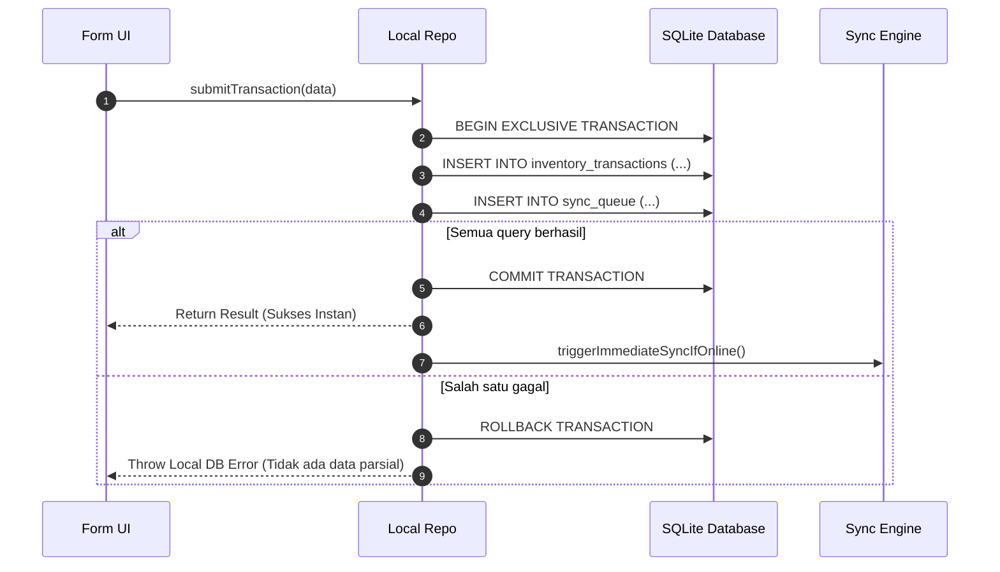

# System Architecture Document (Architecture.md)
## Project: FieldSync Engine

---

## 1. High-Level Architecture Overview

FieldSync Engine mengadopsi pola **Offline-First Outbox Architecture** dengan **Local SQLite sebagai Single Source of Truth (SSOT)** pada perangkat klien. UI tidak pernah berkomunikasi langsung dengan server remote saat melakukan penulisan data (*write operations*); seluruh mutasi ditulis secara lokal terlebih dahulu.

```mermaid
flowchart TB
    subgraph ClientDevice["Perangkat Mobile (Expo / React Native)"]
        subgraph PresentationLayer["Presentation Layer"]
            UI["React Native Screens (Minimalist UI)"]
            RTK["Redux Toolkit (UI & Session State)"]
            TQ["TanStack Query (Reactive Local Data Cache)"]
        end

        subgraph DomainAndData["Domain & Local Data Layer"]
            Repo["Inventory Repository"]
            OutboxMgr["Outbox Queue Manager"]
            ConflictEng["Conflict Resolution Engine"]
        end

        subgraph LocalStorage["Persistent Local Storage (ACID)"]
            DB[("SQLite Database (WAL Mode)")]
            SecureStorage[("Expo SecureStore (Keychain/Keystore)")]
        end

        subgraph BackgroundService["Background & Network Watcher"]
            NetWatcher["NetInfo Network Listener"]
            BgWorker["Background Sync Worker (OS Task / Background Actions)"]
            SyncProcessor["Sync Queue Processor"]
        end
    end

    subgraph RemoteBackend["Enterprise Cloud Backend"]
        Gateway["API Gateway / Ingress"]
        RemoteAPI["REST API Server (Idempotent Handler)"]
        CentralDB[("PostgreSQL / Central Database")]
    end

    UI -->|1. Submit Mutation| Repo
    Repo -->|2. Atomic ACID Txn| DB
    Repo -.->|3. Invalidate Cache| TQ
    TQ -->|4. Re-render UI| UI
    
    NetWatcher -->|Signal Online| SyncProcessor
    BgWorker -->|Periodic Trigger| SyncProcessor
    SyncProcessor -->|Read Pending Tasks| DB
    SyncProcessor -->|HTTPS with Idempotency-Key| Gateway
    Gateway --> RemoteAPI
    RemoteAPI --> CentralDB
    RemoteAPI -->>|Ack / 409 Conflict| SyncProcessor
    SyncProcessor -->|Update Status / Resolve| DB
    DB -.->|Notify Change| TQ
```

---

## 2. Lapisan Tanggung Jawab (Separation of Concerns)

| Layer | Komponen | Tanggung Jawab Utama |
| :--- | :--- | :--- |
| **Presentation** | React Native + Expo Router / Screens | Render antarmuka minimalis, tangkap input pengguna, tampilkan state secara optimistik. |
| **Client State** | Redux Toolkit | Mengelola ephemeral state: filter aktif, modal state, preferensi pengguna, dan status sesi autentikasi. |
| **Data Fetching** | TanStack Query | Abstraksi query reaktif membaca dari database SQLite lokal dan meng-invalidasi cache UI saat ada perubahan di SQLite. |
| **Data Access** | Repository Layer (`inventoryLocalRepo`) | Menyediakan fungsi atomik yang membungkus penulisan ke tabel entitas dan tabel `sync_queue` dalam satu transaksi SQLite. |
| **Local Storage** | `expo-sqlite` (WAL Mode) | Penyimpanan permanen ACID-compliant untuk data transaksi, katalog SKU, dan antrean sinkronisasi. |
| **Security** | `expo-secure-store` | Menyimpan token JWT, refresh token, dan enkripsi *device identifier* secara aman di hardware Keystore/Keychain. |
| **Sync Engine** | Sync Processor + Worker | Mengonsumsi antrean `sync_queue`, menangani *exponential backoff*, menyisipkan header idempotensi, dan menangani respons server. |

---

## 3. Skema Lengkap SQLite (DDL)

Database lokal diinisialisasi dengan konfigurasi **Write-Ahead Logging (WAL)** untuk performa konkurensi tinggi (operasi baca tidak memblokir operasi tulis):

```sql
PRAGMA journal_mode = WAL;
PRAGMA foreign_keys = ON;
PRAGMA synchronous = NORMAL;

-- 1. Metadata Perangkat & Watermark Sinkronisasi
CREATE TABLE IF NOT EXISTS sync_metadata (
    id TEXT PRIMARY KEY DEFAULT 'primary_meta',
    device_id TEXT NOT NULL,
    last_synced_at INTEGER NOT NULL DEFAULT 0,
    schema_version INTEGER NOT NULL DEFAULT 1,
    created_at INTEGER NOT NULL,
    updated_at INTEGER NOT NULL
);

-- 2. Outbox Table: Antrean Mutasi yang Menjamin Zero Data Loss
CREATE TABLE IF NOT EXISTS sync_queue (
    task_id TEXT PRIMARY KEY,               -- UUID v4
    idempotency_key TEXT UNIQUE NOT NULL,    -- UUID v4 untuk mencegah eksekusi ganda di backend
    entity_type TEXT NOT NULL,              -- e.g. 'INVENTORY_TX'
    entity_id TEXT NOT NULL,                -- ID dari record terkait
    operation TEXT NOT NULL,                -- 'CREATE', 'UPDATE', 'DELETE'
    endpoint TEXT NOT NULL,                 -- URL endpoint remote
    http_method TEXT NOT NULL,              -- 'POST', 'PUT', 'PATCH', 'DELETE'
    payload TEXT NOT NULL,                  -- JSON stringified payload
    status TEXT NOT NULL DEFAULT 'PENDING', -- 'PENDING', 'PROCESSING', 'FAILED', 'CONFLICT'
    retry_count INTEGER NOT NULL DEFAULT 0,
    max_retries INTEGER NOT NULL DEFAULT 5,
    next_retry_at INTEGER NOT NULL DEFAULT 0,
    last_error TEXT,
    created_at INTEGER NOT NULL,
    updated_at INTEGER NOT NULL
);

CREATE INDEX IF NOT EXISTS idx_sync_queue_poll 
ON sync_queue (status, next_retry_at, created_at);

-- 3. Entitas Bisnis: Transaksi Inventaris Lapangan
CREATE TABLE IF NOT EXISTS inventory_transactions (
    id TEXT PRIMARY KEY,                    -- UUID v4 dibuat di client
    sku TEXT NOT NULL,
    item_name TEXT NOT NULL,
    type TEXT NOT NULL,                     -- 'INBOUND' / 'OUTBOUND'
    quantity INTEGER NOT NULL,
    notes TEXT,
    version INTEGER NOT NULL DEFAULT 1,     -- Optimistic Concurrency Control version
    sync_status TEXT NOT NULL DEFAULT 'PENDING', -- 'SYNCED', 'PENDING', 'CONFLICT', 'FAILED'
    created_at INTEGER NOT NULL,
    updated_at INTEGER NOT NULL
);

CREATE INDEX IF NOT EXISTS idx_inventory_tx_created 
ON inventory_transactions (created_at DESC);
```

---

## 4. Alur Transaksi Atomik (Write Path)

Kunci keandalan sistem ini adalah: **Data Bisnis dan Tiket Antrean Outbox wajib masuk ke SQLite dalam satu transaksi atomik tunggal.**



---

## 5. Protokol Idempotensi & Resolusi Konflik

### 5.1 Mekanisme Idempotensi
Setiap task di antrean outbox memiliki `idempotency_key` (UUID v4 unik). 
Ketika mengirim request ke server melalui Axios:
```http
POST /api/v1/inventory/transactions HTTP/1.1
Host: api.enterprise-logistics.com
Authorization: Bearer <jwt_token>
Idempotency-Key: 9b1deb4d-3b7d-4bad-9bdd-2b0d7b3dcb6d
Content-Type: application/json

{
  "clientTxId": "3fa85f64-5717-4562-b3fc-2c963f66afa6",
  "sku": "SKU-88401",
  "type": "INBOUND",
  "quantity": 50,
  "clientTimestamp": 1727600000000
}
```
*Jika koneksi drop setelah server memproses mutasi namun sebelum respon ACK sampai ke ponsel, ponsel akan mencoba mengirim ulang request yang sama dengan `Idempotency-Key` yang sama.* Server backend akan mengenali key ini dan mengembalikan status tersimpan tanpa membuat duplikasi data di database pusat.

### 5.2 Strategi Resolusi Konflik (Conflict Resolution)
1. **Server Check**: Setiap mutasi menyertakan `version` entitas lokal.
2. **Conflict Trigger**: Jika versi data di server lebih baru daripada versi yang dikirim client (`server_version > client_version`), server merespon dengan status **HTTP 409 Conflict**.
3. **Client Handling**:
   - `sync_queue.status` diubah menjadi `'CONFLICT'`.
   - `inventory_transactions.sync_status` diubah menjadi `'CONFLICT'`.
   - UI menampilkan badge interaktif *"Butuh Tindakan"* untuk memandu rekonsiliasi manual (*LWW - Last Write Wins* atau *Merge*).

---

## 6. Algoritma Retry & Exponential Backoff

Untuk mencegah fenomena *Thundering Herd* saat puluhan perangkat kembali online bersamaan di area gudang, processor menggunakan algoritma **Exponential Backoff dengan Full Jitter**:

$$\text{Delay} = \min(\text{MaxDelay}, \text{BaseDelay} \times 2^{\text{retry\_count}}) + \text{RandomJitter}$$

* **Base Delay**: 1.000 ms (1 detik)
* **Max Delay**: 60.000 ms (60 detik)
* **Max Retries**: 5 kali sebelum task ditandai `FAILED` untuk inspeksi manual.

---

## 7. Keamanan & Jaringan

1. **Storage Keamanan Tinggi**:
   * Token autentikasi JWT dan refresh token disimpan di `expo-secure-store` yang memanfaatkan hardware Android Keystore / iOS Keychain.
2. **Axios Token Refresh Interceptor**:
   * Menangani HTTP 401 secara transparan: antrean request dipause, refresh token dikirim, dan request diulang dengan token baru tanpa membuat pengguna keluar aplikasi.
3. **Kesiapan SSL Pinning**:
   * Arsitektur modular memungkinkan penambahan SSL Pinning via native plugin (`react-native-ssl-pinning` / `expo-crypto-pki`) saat rilis ke production.
