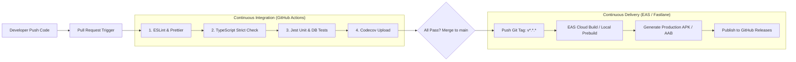

# CI/CD & Mobile Release Pipeline (cicd.md)
## Project: FieldSync Engine

---

## 1. Ikhtisar Alur Kerja DevOps Mobile

Proyek ini menerapkan prinsip **Automated Quality Gate** pada setiap *Pull Request* dan **Automated Release Pipeline** untuk menghasilkan berkas instalasi Android (`.apk` / `.aab`) dan iOS (*TestFlight*) secara otomatis.



---

## 2. Definisi Konfigurasi GitHub Actions (`.github/workflows/ci.yml`)

Workflow ini berjalan otomatis pada setiap *push* dan *pull request* ke branch `main`:

```yaml
name: Mobile CI Pipeline

on:
  push:
    branches: [ main, develop ]
  pull_request:
    branches: [ main ]

jobs:
  quality_gates:
    name: Code Quality & Automated Tests
    runs-on: ubuntu-latest

    steps:
      - name: 📥 Checkout Repository
        uses: actions/checkout@v4

      - name: ⚙️ Setup Node.js Environment
        uses: actions/setup-node@v4
        with:
          node-version: 20
          cache: 'npm'

      - name: 📦 Install Dependencies
        run: npm ci

      - name: 🔍 Linter & Code Formatting Check
        run: npm run lint

      - name: 🛡️ TypeScript Strict Type Check
        run: npx tsc --noEmit

      - name: 🧪 Execute Jest Unit & Integration Tests
        run: npm test -- --coverage --ci --maxWorkers=2

      - name: 📊 Upload Coverage Report
        uses: actions/upload-artifact@v4
        with:
          name: coverage-report
          path: coverage/
```

---

## 3. Definisi Konfigurasi Rilis Otomatis (`.github/workflows/release.yml`)

Workflow ini dipicu ketika pengembang membuat tag versi baru (misal: `git tag v1.0.0 && git push origin v1.0.0`):

```yaml
name: Production Build & Release

on:
  push:
    tags:
      - 'v*'

jobs:
  build_android:
    name: Build Android APK Release
    runs-on: ubuntu-latest

    steps:
      - name: 📥 Checkout Repository
        uses: actions/checkout@v4

      - name: ⚙️ Setup Node.js
        uses: actions/setup-node@v4
        with:
          node-version: 20
          cache: 'npm'

      - name: 📦 Install Dependencies
        run: npm ci

      - name: 🚀 Setup Expo CLI & EAS
        uses: expo/expo-github-action@v8
        with:
          expo-version: latest
          eas-version: latest
          token: ${{ secrets.EXPO_TOKEN }}

      - name: 🔨 Build Standalone APK (Preview / Testing)
        run: eas build --platform android --profile preview --non-interactive

      - name: 📢 Create GitHub Release with APK Artifact
        uses: softprops/action-gh-release@v2
        with:
          generate_release_notes: true
          files: |
            android/app/build/outputs/apk/release/*.apk
        env:
          GITHUB_TOKEN: ${{ secrets.GITHUB_TOKEN }}
```

---

## 4. Konfigurasi `eas.json` (Expo Application Services)

File konfigurasi build untuk mengelola profil *development*, *preview (APK)*, dan *production (AAB)*:

```json
{
  "cli": {
    "version": ">= 10.0.0"
  },
  "build": {
    "development": {
      "developmentClient": true,
      "distribution": "internal"
    },
    "preview": {
      "distribution": "internal",
      "android": {
        "buildType": "apk"
      }
    },
    "production": {
      "android": {
        "buildType": "app-bundle"
      }
    }
  }
}
```

---

## 5. Manajemen Kredensial & Secrets

Semua kredensial sensitif disimpan di **GitHub Repository Secrets** dan tidak pernah di-commit ke Git:

* `EXPO_TOKEN`: Token autentikasi untuk memicu cloud build di EAS.
* `ANDROID_KEYSTORE_BASE64`: Berkas keystore rilis untuk menandatangani APK (*signing*).
* `ANDROID_KEYSTORE_PASSWORD`: Kata sandi keystore rilis.
* `ANDROID_KEY_ALIAS`: Alias kunci penandatanganan aplikasi.
