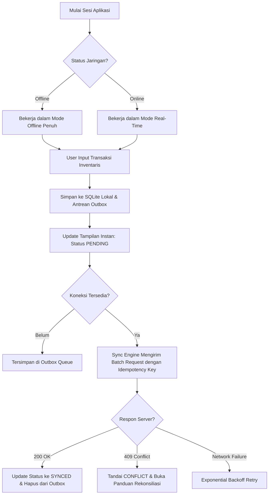

# Product Requirements Document (PRD)
## Project: FieldSync Engine (Offline-First Enterprise Logistics & Field Ops)

---

## 1. Executive Summary & Problem Statement

### 1.1 Background
Operasional logistik lapangan, pergudangan (*warehouse*), dan inspeksi armada sering kali beroperasi di area dengan konektivitas internet tidak stabil atau tanpa sinyal (*dead zone* seperti *basement*, pelabuhan kontainer, dan area pedalaman). Sebagian besar aplikasi seluler tradisional gagal berfungsi saat koneksi terputus: formulir macet (*freezing*), data hilang saat aplikasi tertutup, atau terjadi duplikasi data saat koneksi pulih (*race condition*).

### 1.2 Problem Statement
Bisnis kehilangan jutaan rupiah per hari akibat:
- **Data Loss**: Transaksi barang keluar/masuk tidak tercatat karena petugas tidak bisa menekan tombol submit saat offline.
- **Double Entry & Race Condition**: Petugas menekan submit berulang kali saat koneksi lambat, menimbulkan pencatatan inventaris ganda.
- **Downtime Operasional**: Pekerja terpaksa menunggu sinyal kembali untuk melanjutkan pemindaian barang.

### 1.3 Vision & Solution
**FieldSync Engine** adalah aplikasi seluler *offline-first* dengan desain minimalis utilitarian yang memungkinkan pencatatan mutasi inventaris secara instan tanpa memedulikan status jaringan. Aplikasi menjamin:
- **Zero Data Loss**: Semua transaksi disimpan secara atomik ke SQLite lokal sebelum dijadwalkan ke antrean sinkronisasi (*Outbox pattern*).
- **Zero User Blocking**: Pengguna dapat terus bekerja tanpa menunggu *loading spinner* jaringan (*Optimistic UI*).
- **Conflict & Idempotency Safety**: Setiap transaksi memiliki *Idempotency Key* unik dan nomor versi untuk rekonsiliasi data otomatis saat sinkronisasi ke server.

---

## 2. Target Audience & User Personas

### Persona 1: Joko – Warehouse Field Officer
* **Karakteristik**: Berpindah-pindah di dalam gudang baja bertingkat dengan area *blind spot* Wi-Fi/seluler yang luas.
* **Kebutuhan**: Input data cepat (pemindaian barcode/SKU), respons instan tanpa lag, indikator jelas apakah data sudah terkirim ke server pusat atau masih tersimpan di perangkat.
* **Pain Point**: Frustrasi jika aplikasi meminta login ulang atau menampilkan dialog *"No Internet Connection"* yang memblokir layar.

### Persona 2: Maya – Operations & Logistics Manager
* **Karakteristik**: Memantau pergerakan stok dari dashboard pusat.
* **Kebutuhan**: Kepastian konsistensi data stok, audit trail yang transparan, dan tidak ada rekonsiliasi stok manual akibat data dobel.
* **Pain Point**: Laporan stok gudang tidak sinkron dengan fisik karena penundaan input dari tim lapangan.

---

## 3. Goals and Non-Goals

### 3.1 Primary Goals (In Scope)
1. **Full Offline Mutability**: Pengguna dapat melakukan Create, Read, Update transaksi inventaris saat ponsel dalam *Airplane Mode*.
2. **Atomic Outbox Persistence**: Data transaksi dan tiket antrean sinkronisasi (*sync task*) tersimpan dalam satu transaksi database SQLite lokal (*ACID compliant*).
3. **Automated Background Sync**: Sinkronisasi otomatis berjalan saat sinyal pulih, baik saat aplikasi aktif maupun saat diminimalkan (*background worker*).
4. **Idempotency & Conflict Handling**: Mencegah duplikasi data dengan *UUID v4 Idempotency Key* dan deteksi konflik berbasis versi (*Optimistic Concurrency Control*).
5. **Ultra-Minimalist Utilitarian UI**: Antarmuka bersih, monokrom dengan aksen fungsional, kontras tinggi, navigasi satu tangan, dan bebas ornamen yang memperlambat rendering.

### 3.2 Non-Goals (Out of Scope untuk V1)
1. Pelacakan GPS real-time kontinu tingkat detik (fokus pada data transaksi, bukan live tracking rute armada).
2. Multi-tenant organisasi kompleks (V1 difokuskan pada single-tenant dengan token JWT enterprise).
3. Pemrosesan pembayaran kartu kredit di dalam aplikasi (fokus murni pada pergerakan fisik barang/inventaris).

---

## 4. User Journey & Core Flows

---

## 5. Functional Requirements

### FR-01: Autentikasi & Session Resilience
* Pengguna dapat login dengan email/password atau PIN cepat 6-digit.
* Token JWT dan Refresh Token disimpan terenkripsi di `expo-secure-store`.
* Sesi login tidak boleh kedaluwarsa saat offline; verifikasi dilakukan secara lokal via token tersimpan sampai koneksi pulih.

### FR-02: Manajemen Inventaris & Mutasi Lapangan
* Pengguna dapat memilih SKU barang, memasukkan kuantitas, memilih tipe transaksi (`INBOUND` barang masuk / `OUTBOUND` barang keluar), dan menambahkan catatan.
* Form transaksi memiliki validasi lokal (kuantitas > 0, SKU wajib ada).
* Setelah klik submit, data langsung muncul di daftar transaksi teratas dalam waktu < 50ms tanpa menunggu server.

### FR-03: Outbox Engine & Sinkronisasi
* Setiap mutasi wajib menghasilkan entri di tabel `sync_queue` dengan atribut:
  * `task_id` (UUID), `idempotency_key` (UUID), `entity_type`, `payload` (JSON), `status` (`PENDING`), `retry_count`.
* Listener jaringan (`@react-native-community/netinfo`) memicu prosesor sinkronisasi segera setelah mendeteksi transisi `offline -> online`.
* Background task menjadwalkan pengecekan berkala (interval minimum 15 menit sesuai aturan sistem operasi Android/iOS).

### FR-04: Resolusi Konflik (Conflict Handling)
* Setiap entitas memiliki atribut `version` (integer).
* Jika server mengembalikan HTTP 409 (Conflict), status transaksi ditandai `CONFLICT`.
* Pengguna diberikan antarmuka visual sederhana untuk memilih:
  1. *Keep Local*: Mengirim ulang dengan memaksa versi lokal menimpa server.
  2. *Accept Server*: Memperbarui data lokal dengan state server terbaru.

### FR-05: Monitor & Telemetri Antrean (Sync Dashboard)
* Header aplikasi menampilkan pill status: `Online (Synced)`, `Syncing (X left)`, atau `Offline (X queued)`.
* Terdapat layar khusus **Sync Health & Queue Log** yang menampilkan riwayat antrean, jumlah retry, status HTTP terakhir, dan tombol manual *"Sync Now"*.

---

## 6. Non-Functional Requirements (NFR)

| Kategori | Spesifikasi / Target |
| :--- | :--- |
| **Durabilitas Data** | Zero data loss. Tidak ada transaksi yang hilang meskipun aplikasi dimatikan paksa (*force killed*) tepat setelah tombol submit ditekan. |
| **Kinerja UI** | Waktu respon interaksi submit lokal < 50ms. Rendering list berjalan pada 60/120 FPS tanpa frame drop. |
| **Ukuran Aplikasi** | Bundle ukuran download < 25MB (tanpa aset grafis berat). |
| **Efisiensi Baterai** | Background worker tidak menggunakan *wake lock* konstan; menggunakan scheduler OS hemat daya. |
| **Keamanan Data** | Database SQLite menggunakan mode WAL; token sensitif disimpan di Keystore/Keychain perangkat via `expo-secure-store`. |

---

## 7. Key Success Metrics (KPI)

1. **Local Commit Latency**: P95 < 30ms (Waktu penyimpanan transaksi ke SQLite lokal).
2. **Sync Success Rate**: > 99.8% transaksi dalam antrean berhasil tersinkronisasi saat sinyal stabil.
3. **Zero Duplicate Mutation**: 0 kasus pencatatan ganda pada pengujian simulasi jaringan terputus-putus (*jitter & packet loss*).
4. **Cold Start Time**: Aplikasi siap digunakan dalam < 1.2 detik pada perangkat Android kelas menengah.
