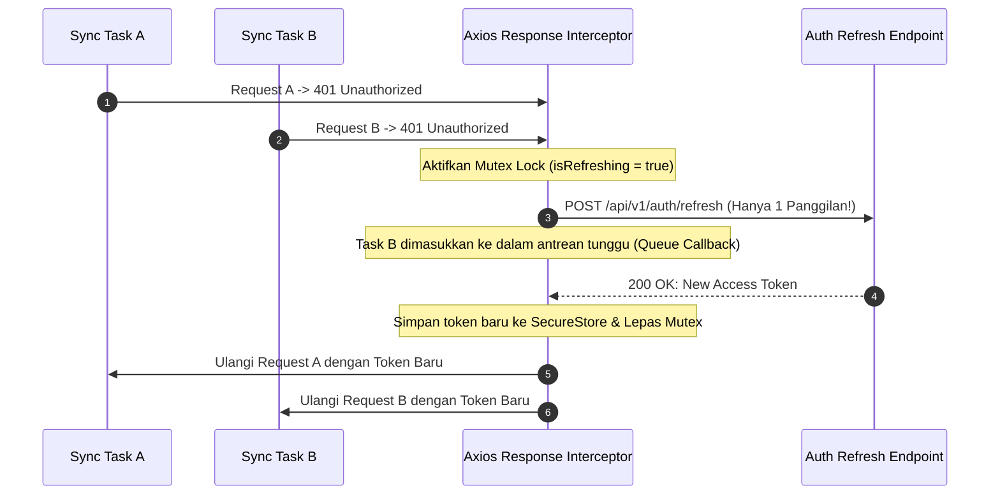

# Mobile Security Architecture & Threat Model (security.md)
## Project: FieldSync Engine

---

## 1. Ikhtisar Keamanan Aplikasi Mobile

Sebagai aplikasi logistik enterprise yang mengelola pergerakan aset berharga, **FieldSync Engine** menerapkan prinsip keamanan berlapis (*Defense-in-Depth*). Kami melindungi data pada tiga keadaan: **Data-at-Rest**, **Data-in-Transit**, dan **Data-in-Memory**.

---

## 2. Threat Modeling: Analisis STRIDE

| Kategori Ancaman | Potensi Risiko Lapangan | Mitigasi pada FieldSync Engine |
| :--- | :--- | :--- |
| **Spoofing (Identitas Palsu)** | Perangkat curian mencoba mengirim transaksi mengatasnamakan operator lain. | Kredensial & sesi disimpan di hardware Keystore. Sesi otomatis mengunci setelah durasi tidak aktif (*idle timeout*). |
| **Tampering (Manipulasi Data)** | Pengguna mengubah isi database SQLite lokal untuk memalsukan jumlah stok. | Database SQLite dilindungi oleh integritas checksum dan verifikasi versi server saat rekonsiliasi. |
| **Repudiation (Penyangkalan Aksi)** | Operator menyangkal telah mencatat mutasi barang keluar. | Setiap transaksi mencatat `device_id`, timestamp klien, dan ditandatangani dengan JWT operator. |
| **Information Disclosure** | Token JWT atau riwayat transaksi terbaca oleh aplikasi pihak ketiga di ponsel yang di-*root*. | Token disimpan di `expo-secure-store` (AES-256 GCM pada Keystore/Keychain). Data sensitif tidak pernah dicatat di `console.log`. |
| **Denial of Service** | Jaringan buruk menyebabkan ratusan percobaan retry simultan yang membebani backend. | Implementasi *Exponential Backoff dengan Jitter* dan pembatasan maksimal antrean. |
| **Elevation of Privilege** | Operator lapangan mencoba memanggil endpoint manajemen inventaris pusat. | Otentikasi berbasis Role-Based Access Control (RBAC) diverifikasi di API Gateway melalui JWT claims. |

---

## 3. Perlindungan Data Lokal (Data-at-Rest)

### 3.1 Penyimpanan Kredensial Sensitif via `expo-secure-store`
Token JWT, Refresh Token, dan `device_id` **dilarang keras** disimpan di `AsyncStorage` biasa karena tidak terenkripsi.

```typescript
// Implementasi: src/core/security/secureStore.ts
import * as SecureStore from 'expo-secure-store';

export const saveAuthTokens = async (accessToken: string, refreshToken: string) => {
  await SecureStore.setItemAsync('auth_access_token', accessToken, {
    keychainAccessible: SecureStore.AFTER_FIRST_UNLOCK,
  });
  await SecureStore.setItemAsync('auth_refresh_token', refreshToken, {
    keychainAccessible: SecureStore.AFTER_FIRST_UNLOCK,
  });
};

export const getAccessToken = async (): Promise<string | null> => {
  return await SecureStore.getItemAsync('auth_access_token');
};

export const clearAuthSession = async () => {
  await SecureStore.deleteItemAsync('auth_access_token');
  await SecureStore.deleteItemAsync('auth_refresh_token');
};
```

---

## 4. Perlindungan Komunikasi Jaringan (Data-in-Transit)

### 4.1 Enkripsi Wajib TLS 1.3
* Seluruh komunikasi API wajib melalui protokol HTTPS dengan cipher TLS 1.3 yang kuat.
* Konfigurasi `network_security_config.xml` pada Android melarang koneksi *cleartext HTTP* (`android:usesCleartextTraffic="false"`).

### 4.2 Siklus Hidup Token & Penanganan Mutex Race Condition
Saat beberapa antrean mencoba melakukan sinkronisasi bersamaan dan access token kedaluwarsa (HTTP 401), aplikasi menggunakan mekanisme **Mutex Lock** agar request refresh token ke server hanya dieksekusi **satu kali**:



---

## 5. Sanitasi Log & Praktik Anti-Bocor (No-Leak Policy)

1. **Log Sanitization**:
   * Seluruh header `Authorization: Bearer ***` dan `payload.pin` otomatis disensor pada interceptor logging jaringan sebelum dicetak ke terminal debug.
2. **Build Production Stripping**:
   * Compiler Babel/Metro dikonfigurasi untuk menghapus seluruh statement `console.log` dan `console.debug` pada rilis produksi (`babel-plugin-transform-remove-console`).
3. **Screen Obfuscation (Recent Apps)**:
   * Saat aplikasi diminimalkan ke daftar *recent apps*, layar disamarkan untuk mencegah informasi inventaris atau data sensitif terlihat oleh orang lain.
